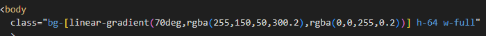
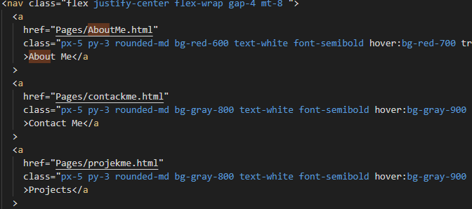
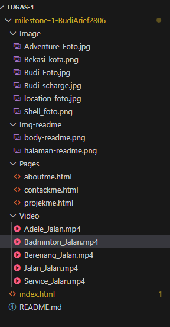

# Portofolio Arief Budianto

## Overview

Website ini menceritakan tentang pengalaman bekerja di SHELL ,Aktifitas keseharian saya.
Ada beberapa dokkumtasi berupa foto dan videonya .
Ada beberapa fitur di website ini agar para pengujung website mudah melihat profil ,Whatsapp dan Instagram pribadi,menggunakan hirarki dengan baik h1-h5.
Tujuan membuat website ini Adalah memberikan informasi tentang pengalaman pribadi profesional saya dan memberikan akses untuk kerja sama

## Features Implemented

Profil interaktif dan biografi dengan foto
Navigasi antar halaman: About Me, Contact Me, Projects
Section pengalaman & minat, tersaji dalam card grid responsif
Dokumentasi perjalanan, musik, swim, servis HP, masing-masing dengan video embed
Desain responsif & animasi smooth (md,sm ,hover, scale, spin) untuk pengalaman UX optimal
Penggunaan Tailwind CSS utility classes untuk layout, warna, typography, spacing, grid/flex, background custom, dan animasi

## teknologi

Mengunakan bahasa : HTML tailwind

### About me

Menceritkan tentang diri saya sendiri
dan saya menanpilkan 1 animasi untuk ke home

### contack me

Pengujung bisa menghubungkan saya pribadi seperti :WA,IG

### Projek

di halaman ini impian saya bisa lebih baik dari hari sebelumnya

### screenshot

    Memberikan warna warni background web Bg-rgba-90derajat

ini adalah code agar masuk ke halaman berikutnya

    Struktur file agar terlihat rapih

## deploy git action

link : [Portofolio Arief Budianto](https://revou-fsse-oct25.github.io/milestone-1-BudiArief2806/)
